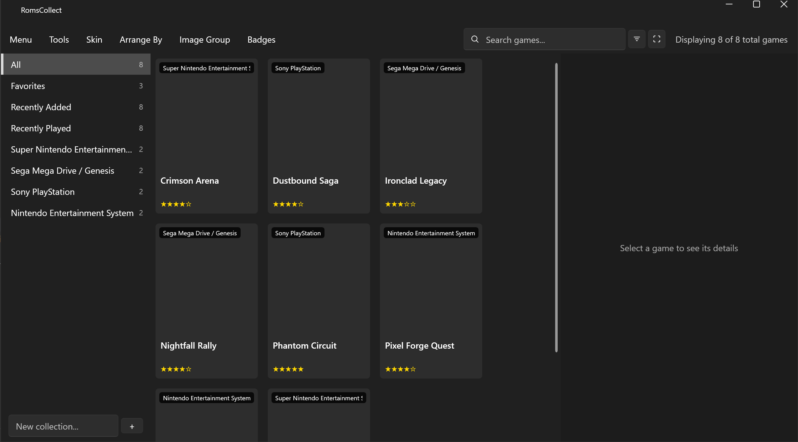

# RomsCollect

RomsCollect is a portable, offline video game collection manager for
Windows 10/11 (x64). It combines a browsing frontend (grid, wheel/carousel,
or a tabular catalog; launch games through configurable emulator profiles)
with a full collector's cataloger (condition, purchase info, completeness,
personal notes, tags, and a manually entered collection value — no online
pricing lookups of any kind).

- **Platform:** Windows 10/11, x64 only.
- **Portable:** no installer. The application and all of its data live in
  one folder; nothing is written outside it and nothing touches the
  registry.
- **Offline:** RomsCollect never makes a network request at runtime — no
  telemetry, no update checks, no online metadata or cover-art lookups.
  A game's download-link field stores a plain URL the user typed in
  themselves; clicking it opens the system's default browser only after
  an explicit confirmation, which is the one point where the user
  deliberately steps outside the application.
- **License:** GNU General Public License v3.0 or later
  (GPL-3.0-or-later). See `LICENSE` at the repository root, and
  `THIRD_PARTY_NOTICES.md` for every bundled dependency's license.
- **Contact:** sandefjord.development@proton.me
- **Website:** https://patrickjaillet.github.io/RomsCollect



## Features

- **Grid, wheel, and tabular catalog views** of your collection, switchable
  from the `Arrange By` menu, with instant search and configurable sort.
- **Standard per-system ROM folders** (`data/Roms/<system>/`) and
  **per-system, per-media-type folders**
  (`data/Media/<system>/<Media Type>/`), so an existing collection using
  the same conventions can be dropped in directly, plus an assisted
  importer for both.
- **Full cataloging**: title, platform, release date, developers,
  publishers, genres, series, format, edition, region, and a separate
  "Personal" record per copy (condition, owner, purchase info, storage
  location, manually entered current value, completeness, tags, rating,
  notes).
- **Per-game download links and manual**, opened through the system's
  default handler only after explicit confirmation.
- **Emulator launching** through per-system profiles (executable path,
  command-line template, working directory), with pre-filled templates
  for RetroArch, Dolphin, PCSX2, and DuckStation — RomsCollect never
  downloads or bundles an emulator itself.
- **Automatic play history** (session count, total play time) recorded
  each time a game is launched and the emulator process exits.

## Getting started

RomsCollect is fully portable: download the release archive, extract it
anywhere (a USB drive works fine), and run `RomsCollect.exe`. No
installer, no admin rights, no .NET runtime to install separately.

On first launch, `data/Roms/<system>/` is where you place your ROM files
(one subfolder per system, using RomsCollect's naming convention — `snes`,
`nes`, `megadrive`, `psx`, `mame`, `amiga1200`, etc.), and
`data/Media/<system>/<Media Type>/` is where matching box art, screenshots,
fanart, and videos go (using RomsCollect's media-type naming convention —
`Box - Front`, `Screenshot - Gameplay`, `Clear Logo`, and so on). Use
`Menu > Scan for New Games...` to pick them up, or `Menu > Import
Collection...` if you already have an existing ROM set or media library
organized the same way to bring in.

### Configuring emulators

Open `Menu > Settings... > Emulators`, pick a system, choose a preset
(RetroArch, Dolphin, PCSX2, DuckStation) or write a custom command-line
template, and point it at an emulator executable you already have
installed. The `{RomPath}` placeholder in the template is replaced with
the full, quoted path to the selected game's ROM file when you press
Play.

## Repository layout

```
src/RomsCollect/      Application source (WPF, MVVM)
tests/                 Unit tests
docs/                  English documentation (architecture, user guide)
data/                  Portable data root: Roms/, Media/, Database/,
                       Bios/, Saves/, Screenshots/, Themes/, Logs/, Backup/
assets/                Logo, application icon
i18n/                  UI text, JSON, English by default
scripts/               Build and scaffolding scripts
```

`data/Roms/<system>/` follows RomsCollect's system-folder convention.
`data/Media/<system>/<Media Type>/` follows RomsCollect's media-type
convention (`Box - Front`, `Screenshot - Gameplay`, etc.), so an
existing ROM set or media library organized the same way can be dropped
in directly.

## Documentation

- `docs/ARCHITECTURE.md` — solution layout, layers, technical choices.
- `docs/USER_GUIDE.md` — full user guide (importing a collection,
  configuring systems and emulators, cataloging, download links).

## Third-party dependencies

See `THIRD_PARTY_NOTICES.md`. Every dependency must be verified
compatible with GPL-3.0-or-later distribution before being added.
